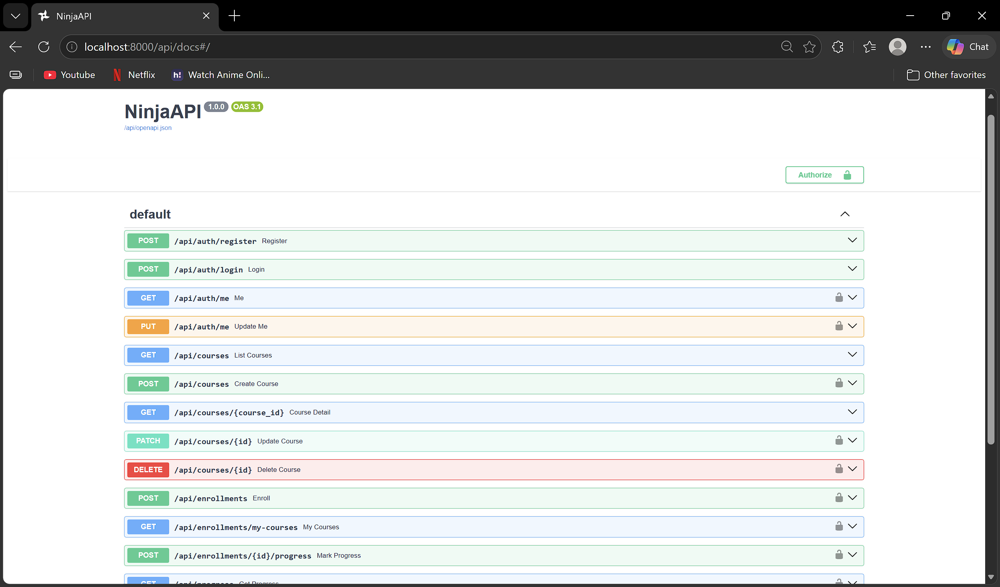
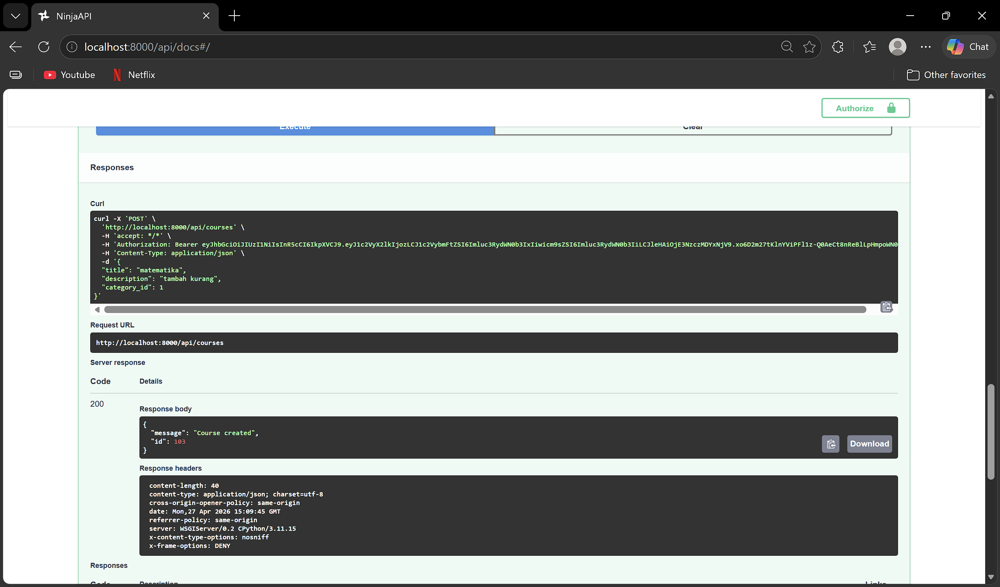
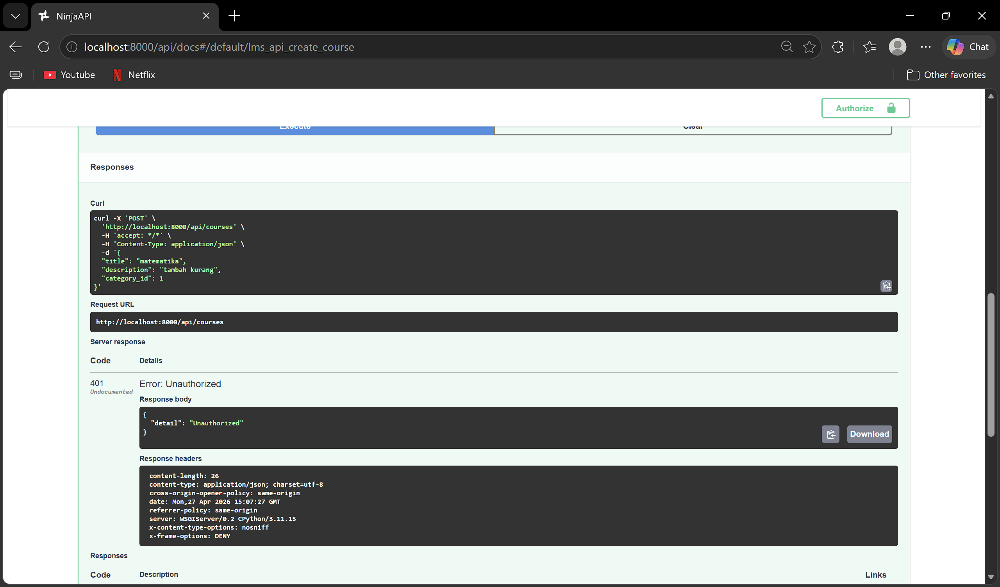
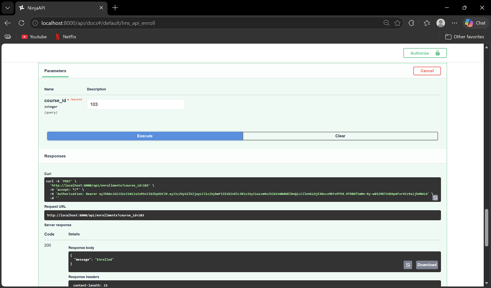
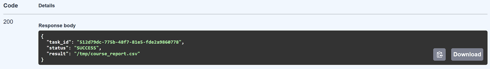
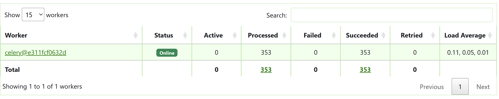
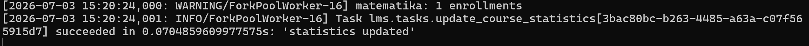

# Simple LMS Extended API (Django Ninja + JWT + RBAC + Celery Async)

## Deskripsi

Project ini merupakan pengembangan lanjutan dari Simple Learning Management System (LMS) berbasis REST API menggunakan:
- Django + Django Ninja
- PostgreSQL
- Docker
- JWT Authentication
- Role-Based Access Control (RBAC)
- Celery + RabbitMQ (Asynchronous Task Queue)
- Redis (Cache & Result Backend)

API ini memungkinkan manajemen user (Admin, Instructor, Student), pengelolaan kelas, pendaftaran kursus, tracking progres belajar, hingga pemrosesan tugas berat secara asinkron di latar belakang agar server tidak lemot.

## Fitur Utama

### Authentication (JWT)
- Register user secara dinamis menentukan role
- Login untuk generate token akses
- Get dan update data profil user

### Courses
- List semua kelas (terbuka untuk publik)
- Detail info kelas spesifik
- Create kelas baru (Khusus Instructor)
- Update data kelas (Khusus Owner kelas)
- Delete kelas dari sistem (Khusus Admin)

### Enrollment
- Daftar ke kelas pilihan (Khusus Student)
- Melihat daftar kelas yang sedang diikuti

### Progress
- Tandai materi atau lesson yang selesai
- Melihat persentase progres belajar

### Reports & Async Tasks (Paket 6 Fitur Tambahan)
- Kirim notifikasi email otomatis lewat background task Celery pas student berhasil enroll kelas
- Generate laporan statistik kelas format CSV di background (Khusus Admin dan Instructor)
- Cek status pengerjaan tugas laporan pakai task ID buat liat hasilnya
- Update otomatis data statistik berkala pakai scheduled task dari Celery Beat
- Monitoring aktivitas worker Celery secara langsung pakai dashboard visual Flower

## Cara Menjalankan Project

### 1. Clone Repository
git clone https://github.com/Syafunn/simple-lms.git
cd simple-lms

### 2. Jalankan Docker
Pastikan sudah copy file .env.example menjadi .env sebelum menyalakan service:
cp .env.example .env
docker-compose up -d --build

### 3. Jalankan Migration
docker-compose exec web python manage.py migrate

### 4. Akses API & Layanan
- Dokumentasi API (Swagger UI): http://localhost:8000/api/docs
- Dashboard Monitoring Celery (Flower): http://localhost:5555

## API Documentation (Swagger)

Swagger tersedia di /api/docs dan bisa langsung dipakai buat testing semua endpoint yang tersedia.

### Authentication
Untuk endpoint yang dikunci, gunakan JWT token pada header dengan format:
Authorization: Bearer <access_token>

## API Endpoints

### Auth
- POST /api/auth/register
- POST /api/auth/login
- GET /api/auth/me
- PUT /api/auth/me

### Courses
- GET /api/courses
- GET /api/courses/{id}
- POST /api/courses
- PATCH /api/courses/{id}
- DELETE /api/courses/{id}

### Enrollment
- POST /api/enrollments
- GET /api/enrollments/my-courses

### Progress
- POST /api/enrollments/{id}/progress
- GET /api/progress

### Reports & Async Tasks
- POST /api/reports/generate
- GET /api/reports/status/{task_id}

## Role-Based Access Control (RBAC)

| Role | Hak Akses Fitur |
|---|---|
| Admin | Hapus kelas, kelola penuh sistem, pemicuan semua report |
| Instructor | Bikin kelas baru, edit kelas milik sendiri, pemicuan report kelas |
| Student | Daftar kelas (enroll), update progress materi, liat riwayat belajar |

## Database

Menggunakan PostgreSQL sebagai database utama dan Redis sebagai temporary storage (Cache & Celery Backend) yang semuanya berjalan di dalam container Docker.

## Tech Stack

- Django
- Django Ninja
- PostgreSQL
- Docker & Docker Compose
- Redis
- RabbitMQ
- Celery & Celery Beat
- Flower
- JWT (python-jose)
- Pydantic

## Screenshots

Folder img/ berisi bukti visual pengujian:

1. Swagger API Docs Interface
Menampilkan dokumentasi skema endpoint lengkap yang interaktif dan siap pakai.

2. Pengecekan RBAC (Success)
Bukti response sukses 200 OK saat endpoint diakses oleh role user yang memiliki hak akses resmi.

3. Pengecekan RBAC (Failed)
Bukti response error atau terblokir saat endpoint coba diakses oleh role yang tidak berwenang.

4. Proses Enrollment Student
Bukti jalannya proses pendaftaran kelas oleh student yang langsung memicu background task.

5. Hasil Task Status SUCCESS di Endpoint
Response dari endpoint tracker yang menampilkan status SUCCESS beserta lokasi aman file laporan CSV.

6. Live Monitoring di Dashboard Flower
Tampilan panel monitoring Flower yang merekam aktivitas worker Celery secara real-time di latar belakang.

7. Trigger Report Background Task
Bukti log pemicuan dan eksekusi async task yang berjalan lancar tanpa mengganggu performa API utama.

## Project Structure

simple-lms/
├── docker-compose.yml
├── requirements.txt
├── .env.example
├── config/
│   ├── settings.py
│   ├── urls.py
│   └── celery.py
├── lms/
│   ├── api.py
│   ├── models.py
│   ├── schemas.py
│   └── tasks.py
└── README.md

## Additional Features

### Redis Caching
Implementasi Redis caching diterapkan pada:
- Course List API
- Course Detail API
- Weather API Simulation
Cache timeout: 300 seconds (5 minutes)

Kenapa response time berbeda?
- Pada pemanggilan pertama aplikasi mengambil data dari database atau API eksternal yang memiliki delay proses.
- Pada pemanggilan kedua, data sudah dibungkus dan disimpan di memori Redis, jadi aplikasi tinggal ambil dari sana tanpa perlu request ulang ke database utama.

Apa keuntungan caching?
- Waktu respon server jadi jauh lebih instan (low latency)
- Mengurangi beban kerja dan query berulang ke database
- Server jadi lebih tangguh pas nerima banyak traffic sekaligus

Kapan sebaiknya tidak menggunakan cache?
- Data yang nilainya sangat dinamis dan berubah tiap detik
- Membutuhkan validasi data real-time (seperti sisa saldo atau stok barang kritis)
- Data sensitif yang sifatnya rahasia antar user

### Asynchronous Background Workers (Celery + RabbitMQ)
Sistem asinkron ini dipasang untuk memisahkan tugas komputasi berat dari jalur utama API:
- Pengiriman Email: Proses kirim email notifikasi dipindahkan ke background biar student gak perlu nunggu loading pas klik tombol daftar kelas.
- Pembuatan Laporan: Proses menyusun file CSV dikerjakan oleh worker Celery. User langsung dapet task ID dalam hitungan milidetik, sementara file aslinya diproses dengan aman di belakang layar.

## Kesimpulan

API LMS ini berhasil dikembangkan dengan performa tinggi berkat gabungan:
- JWT Authentication buat keamanan token
- Role-Based Access Control buat pembatasan hak user
- Redis Caching buat speed up pembacaan data kelas
- Celery Workers buat ngeringin tugas-tugas berat di background
- Dokumen Swagger lengkap yang siap diuji dan dikembangkan lebih lanjut